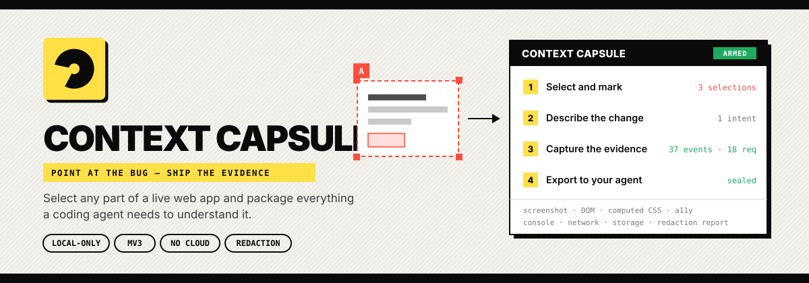

<div align="center">



<br>

**Select any part of a live web application and package everything a coding agent needs to understand it.**

<br>

[](tests)
[](extension/manifest.json)
[](companion/mcp-server.js)
[](#security)
[](#what-works-and-what-doesnt)

</div>

---

## The problem

You hand your coding agent a screenshot and say *"fix this."*

The agent gets a flat image. It cannot see which component rendered that box, what
props it received, which API call produced the text, what the console said two
seconds earlier, or what you actually wanted instead.

Context Capsule turns:

> *"Something is wrong around here"*

into:

> *"**This** exact component, rendered by **this** component tree, using **this**
> state and API response, looked like **this** at **this** moment, after **these**
> actions, with **these** errors."*

The human points at what matters. The extension collects only the technical
evidence relevant to that selection, redacts the credentials, and writes a
structured capsule an agent can read over MCP.

---

## How it works

```
     you                     extension                  companion              agent
      │                          │                          │                    │
      │  arm ────────────────────▶  chrome.debugger          │                    │
      │                          │  rolling buffer:          │                    │
      │  click a component ──────▶  console · network        │                    │
      │  ↑↓←→ walk the tree      │  exceptions · nav         │                    │
      │  box · arrow · pen · text│                          │                    │
      │                          │                          │                    │
      │  "what's wrong / what    │                          │                    │
      │   should happen" ────────▶  freeze the window       │                    │
      │                          │  screenshot + crop        │                    │
      │  add frame ──────────────▶  DOM · CSS · a11y ·      │                    │
      │  (resize, reroute, ...)  │  listeners · app state    │                    │
      │                          │                          │                    │
      │  export ─────────────────▶  redact · hash · review ──▶ capsule directory  │
      │                          │                          │  capsule://…       │
      │  paste prompt ───────────┼──────────────────────────┼───────────────────▶ reads it
```

Every selection gets an ID — `A`, `B`, `C` — and that ID is the join key across
the screenshot, the DOM files, the component state and the manifest.

---

## What goes in a capsule

```text
context-capsule-2026-08-05T18-24-00-000Z/
├── manifest.json                     ← the index: intent, page, frames, selections
├── README_FOR_AGENT.md               ← read order and rules, written for the agent
├── prompt.md                         ← one-paragraph task statement
├── integrity.json                    ← SHA-256, byte count and encoding per file
├── visual/
│   ├── board.png                     ← numbered collage of every frame
│   └── frame-01.png …                ← full-resolution frames, never only the collage
├── page/
│   ├── frame-01-selection.json       ← subtree, ancestors, siblings, boxes, styles, a11y
│   └── frame-01-cdp.json             ← per-node CDP: matched rules, AX tree, listeners
├── runtime/
│   └── frame-01-runtime.json         ← console, exceptions, network, bodies, navigations
├── framework/
│   └── frame-01-app-context.json     ← route, state, flags, components (needs the bridge)
└── security/
    └── redaction-report.json         ← what was stripped, and what still needs a look
```

The capsule states its own limits. `captureWindow.note` says runtime evidence
begins when you armed capture, `truncated` flags say which buffers hit their cap,
and `domSnapshotSkipped` says the full-page snapshot was not requested — so an
agent never reads *absence of evidence* as *evidence of absence*.

---

## Install

**1. Companion dependencies**

```bash
cd companion
npm install
```

**2. Load the extension**

`chrome://extensions` → enable **Developer mode** → **Load unpacked** →
select `extension/` → copy the 32-character extension ID.

**3. Register the native messaging host**

```bash
cd companion
node install-host.mjs YOUR_EXTENSION_ID
```

The ID must be exactly 32 lowercase characters in `a`–`p`. Restart Chrome so it
picks up the host manifest.

**4. Point your agent at the MCP server**

```json
{
  "mcpServers": {
    "context-capsule": {
      "command": "node",
      "args": ["C:/Ranit/Libs/Fe-shot/companion/mcp-server.js"]
    }
  }
}
```

Tools: `list_captures` · `list_capture_files` · `read_capture_file`.

---

## Use

| Step | Action |
| --- | --- |
| **Arm** | Attaches the debugger and starts the rolling buffer. The status pill pulses while recording. |
| **Select** | Click a component. <kbd>Shift</kbd>+click adds more. <kbd>↑</kbd><kbd>↓</kbd> walk parent/child, <kbd>←</kbd><kbd>→</kbd> walk siblings. |
| **Mark** | Region, box, arrow, pen, text. Annotations are stored as JSON *and* drawn into the frame. |
| **Describe** | What is wrong, what should happen. This is the single most valuable field in the capsule. |
| **Add frames** | Change viewport, route, theme or state and capture again. Frames become a numbered board. |
| **Review** | See what is included, what was stripped, and what still needs a human eye. |
| **Export** | Writes the capsule locally and copies an agent prompt to the clipboard. |

Capsules land in `%TEMP%/context-capsules/<captureId>` — override with
`CONTEXT_CAPSULE_DIR`.

---

## Security

This tool can see anything your browser can see, so the defaults are strict.

- **Local only.** No cloud, no account, no telemetry, nothing leaves the machine.
- **Nothing is captured until you arm it**, and the pill pulses the whole time.
- **Authorization and cookie headers never make it to disk.** Neither do
  credential-shaped object keys, password or payment fields, or binary bodies.
- **Redaction runs at ingest**, before anything is stored: bearer tokens, JWTs
  (header-verified), vendor API keys, private key blocks, Luhn-valid card
  numbers, emails, and bare high-entropy tokens caught by an entropy sweep.
- **Response bodies are capped** at 1 MB; whole capsules at 100 MB.
- **Every export is reviewed.** A second, independent pass runs over the finished
  capsule; if it still finds anything credential-shaped, the export stops and
  asks you.

Regex and entropy scanning are a safety net, **not a security model**, and the
redaction report says so in writing. Treat a capsule as sensitive.

---

## What works, and what doesn't

**Verified by the test suite** — `npm test`, 103 tests:

| Area | Covered |
| --- | --- |
| Redaction | Tokens, JWTs, vendor keys, cards, emails, entropy sweep — and the false positives that must *survive* (semver, order IDs, minified chains) |
| Worker termination | A session written, the module registry reset, and every event, request and body read back |
| Buffer discipline | Caps, oldest-first eviction, monotonic sequence numbers, rolling-window filtering, truncation flags |
| Path safety | Traversal, absolute paths and drive-letter escapes rejected — in the library *and* through the running native host |
| Companion transports | Real length-prefixed framing (including a frame split across two chunks) and real MCP `initialize` / `tools/list` / `tools/call` |
| Clock handling | Monotonic CDP timestamps anchored to wall time, ordering preserved, no future timestamps |
| Cross-file wiring | Every panel element id, message type, tool name, host name and manifest permission checked against the file that has to agree with it |

**Known gaps.** These are real, and none of them are hidden in a footnote:

- **Cross-origin iframes and workers are only partly handled.** Flat auto-attach
  is on and child sessions are recorded, but CDP domains are not yet enabled
  per child target.
- **Runtime evidence starts at arm time.** Nothing before that is recoverable.
- **Framework provenance needs the bridge.** Without `bridge/`, component names,
  props and store state are unavailable; there are no React/Vue/Angular adapters
  yet.
- **API-field → DOM-text mapping is not proven.** No generic extension can prove
  it through selectors, caches and transforms. The bridge is how exact
  provenance gets added.
- **The browser-side flow has not been exercised in a live Chrome session.**
  The companion half is covered end to end; the extension half is not.
- **Not a shipped product.** No signed installer, no store package, no privacy
  policy, no auto-update. The companion needs Node on the machine.

---

## Layout

```text
extension/    MV3 extension — side panel, overlay, CDP capture, durable sessions
  ├── background.js      orchestration; holds no capture state in worker memory
  ├── session-store.js   chrome.storage.session persistence + bounded buffers
  ├── redact.js          pure, unit-tested redaction and review scanning
  └── content.js         selection overlay, annotation, page-side snapshotting
companion/    Node native-messaging host + MCP stdio server
bridge/       Optional in-app SDK for exact render provenance
brand/        Mark, lockup, banner and the brand rules
tools/        Icon generator — regenerates extension/icons from the mark geometry
tests/        Vitest suite
```

```bash
npm test          # full suite
npm run icons     # regenerate icons from brand geometry
```

---

<div align="center">
<sub><b>Figma comments + DevTools + MCP, for live applications.</b><br>
The screenshot is just the cover page.</sub>
</div>
